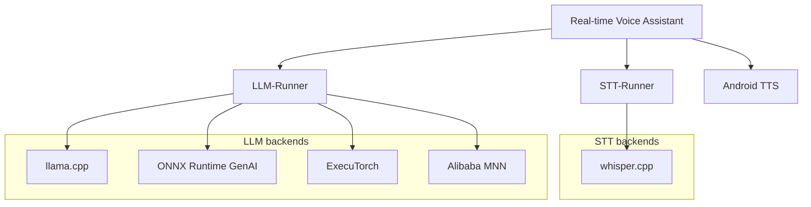
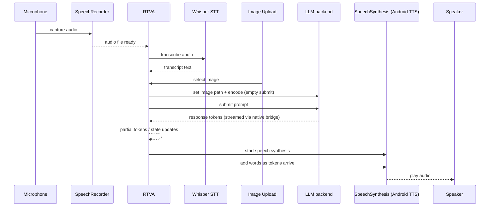

<!--
    SPDX-FileCopyrightText: Copyright 2026 Arm Limited and/or its affiliates <open-source-office@arm.com>

    SPDX-License-Identifier: Apache-2.0
-->

# System Overview

This project is an Android voice assistant application that combines Speech-to-Text (STT), a Large Language Model (LLM), and Text-to-Speech (TTS) into a single on-device pipeline.

## Table of Contents

- [High-Level Modules](#high-level-modules)
- [Software Architecture](#software-architecture)
- [Runtime Pipeline](#runtime-pipeline)
    - [Speech Synthesis](#speech-synthesis)
- [User Interface Layer](#user-interface-layer)
- [Configuration and Models](#configuration-and-models)
- [LLM Framework Selection](#llm-framework-selection)
- [Optional Visual Question Answering (VQA)](#optional-visual-question-answering-vqa)
- [Key Files](#key-files)

---
## High-Level Modules

- `app/`: Android application (Jetpack Compose UI, view models, pipeline orchestration)
- `stt/`: Speech-to-Text module (STT-Runner) based on whisper.cpp
- `llm/`: LLM module (LLM-Runner) based on llama.cpp (and other selectable backends)
- `resources/`: Shared assets and model configuration files

---
## Software Architecture

The diagram below shows the end-to-end application pipeline and how STT-Runner and LLM-Runner invoke KleidiAI to accelerate execution on Arm CPUs, including SME CPU architecture features, via Java/Kotlin → JNI → native layers.



---
## Runtime Pipeline

At runtime, the app coordinates the following steps within RTVA (the combined UI + Pipeline layer):

1. **Audio capture**: `SpeechRecorder` records microphone input to a local audio file.
2. **Transcription**: RTVA triggers STT to transcribe audio to text.
3. **LLM inference**: RTVA submits the prompt to the selected LLM backend.
4. **Token streaming + UI updates**: RTVA reads streamed tokens from the native bridge and updates chat/UI state as tokens arrive.
5. **Speech output**: When TTS is enabled, RTVA starts `SpeechSynthesis` and feeds words/tokens as they stream.

Orchestration is unified under RTVA, which covers UI state, STT/LLM/TTS lifecycle, native calls, and end-to-end streaming updates.



---
### Speech Synthesis

Speech synthesis happens in the Android app layer via the `SpeechSynthesis` component, which wraps the platform Text-to-Speech engine. It is invoked from `Pipeline.kt` after an LLM response is produced, and the audio is rendered locally on the device.

## User Interface Layer

The UI is built with Jetpack Compose and is organized under:

- `app/src/main/java/com/arm/voiceassistant/ui/`
- `app/src/main/java/com/arm/voiceassistant/ui/composables/`
- `app/src/main/java/com/arm/voiceassistant/ui/screens/`
- `app/src/main/java/com/arm/voiceassistant/ui/theme/`
- `app/src/main/java/com/arm/voiceassistant/viewmodels/`

`MainActivity` sets up the UI, requests microphone permissions, and initializes the main view model.

## Configuration and Models

- **STT config**: `stt/stt-src/model_configuration_files/whisperTextConfig.json`
- **LLM config**: `llm/llm-src/model_configuration_files/{Framework}{Text|Vision}Config-{ModelName}.json`
- **Model files**: downloaded during the build and pushed to the device via `app/pushAppResources.py`

The `Pipeline` loads default configs when user configs are missing or invalid, and can read custom configs if provided.

## LLM Framework Selection

The LLM backend is chosen at build time via the `llmFramework` [Gradle property](../gradle.properties). Supported values include:

- `llama.cpp` (default)
- `onnxruntime-genai`
- `mnn`
- `executorch`

Example:

```bash
./gradlew assembleDebug -PllmFramework=onnxruntime-genai
```

## Optional Visual Question Answering (VQA)

The app supports optional image-based prompts. An image can be uploaded and encoded into embeddings,which are retained in context for follow-up queries until the context is reset.

## Key Files

- `app/src/main/java/com/arm/voiceassistant/Pipeline.kt`
- `app/src/main/java/com/arm/voiceassistant/MainActivity.kt`
- `app/pushAppResources.py`
- `stt/` and `llm/` module build files and native bindings
